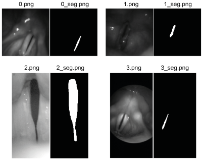

# BAGLS

In an international collaboration, we created the Benchmark for Automatic Glottis Segmentation (BAGLS) that consists of 59,250 videoendoscopic images acquired from hundreds of individuals at seven hospitals.

## High-speed videoendoscopy

In contrast to stroboscopy, high-speed videoendoscopy (HSV) visualizes the full vocal fold oscillation cycle. To quantitatively describe these oscillations, the glottal area (the opening between the vocal folds) is typically segmented [[1](#citation1)]. A lot of previous studies tried to automatize the approach, because this is one of the limiting steps for clinical applicability of HSV. However, there is no public dataset to compare these methods, and these methods were evaluated and tested only from a specific source, so cross-applicibality is limited. With BAGLS, we try to overcome this issue by providing an open, diverse and carefully annotated dataset. All details of the BAGLS dataset are described in the publication below.

## BAGLS benchmark dataset

The BAGLS benchmark dataset is split into 55,750 training images and 3,500 test images, as well as the raw data. The test images are balanced across all the international groups that provided data. All the images and videos are shuffled and anonymized, so that one cannot track back individuals and the data origin. For each frame (following the scheme ```#.png```), there is a respective segmentation mask (following the scheme ```#_seg.png```) and respective metadata (```#.meta```). The segmentation mask was created using  either the [Glottis Analysis Tools](http://www.hno-klinik.uk-erlangen.de/phoniatrie/forschung/computational-medicine/gat-software/), [PiPrA](https://github.com/anki-xyz/pipra) or both. The raw data are provided with metadata and corresponding segmentation maps (created by our baseline model, as provided here).

In the following Figure the first frames from the test dataset are shown:



## Semantic segmentation using deep neural networks

To offer a baseline, we trained an encoder-decoder network. For this task, we used a popular architecture in biomedical image segmentation: the U-Net from Olaf Ronneberger _et al._ [[2](#citation2)].
Our implementation follows largely the vanilla U-Net, we further apply Batch Normalization before each activation function. 

We trained for 25 epochs using a dice loss, each epoch took roughly 38 minutes with our configuration (TensorFlow 1.13.1, Keras 2.2.4 on an Intel Xeon Silver 4116 CPU and a Titan RTX GPU). The model with the largest Intersection over Union (IoU) score on the validation set (0.831) was achieved after 21 epochs. Its performance on the test set revealed an IoU of 0.799. 

Using the trained network, we are able to reliable segment also unknown data:


## Using the code

We provide two jupyter notebooks. One to train a U-Net model on the data and one to compute the IoU on the test data. You will need to adapt the paths to your local ones. 

## How to cite BAGLS

Gómez, P., Kist, A.M., et al. BAGLS, a multihospital Benchmark for Automatic Glottis Segmentation. Sci Data 7, 186 (2020). https://doi.org/10.1038/s41597-020-0526-3

## References

<a name="citation1">[1]</a> Deliyski, D. D., Petrushev, P. P., Bonilha, H. S., Gerlach, T. T., Martin-Harris, B., & Hillman, R. E. (2008). [Clinical implementation of laryngeal high-speed videoendoscopy: Challenges and evolution.](https://doi.org/10.1159/000111802) Folia Phoniatrica et Logopaedica, 60(1), 33-44.

<a name="citation2">[2]</a> Ronneberger, O., Fischer, P., & Brox, T. (2015, October). [U-net: Convolutional networks for biomedical image segmentation.](http://dx.doi.org/10.1007/978-3-319-24574-4_28) In International Conference on Medical image computing and computer-assisted intervention (pp. 234-241). Springer, Cham.


